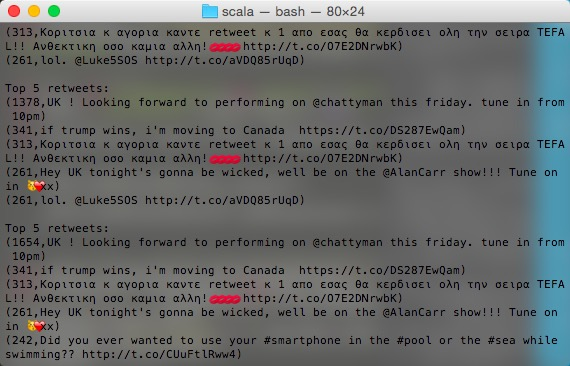

**Exercise 2. Spark Streaming (70% of the grade)**

The task in this exercise is to write a standalone Spark streaming application with the following characteristics:

1. Continuously reads Twitter feed every second
2. Collects the feed in a sliding window of 60 seconds
3. Calculates the most 5 retweeted tweets within the 60 second window (see Tip c below)
4. Prints the top 5 tweets calculated every second for the sliding window
5. Write a short report describing your work

Tips and notes:

+ Accustom yourself first with Spark streaming using the example on [here](https://databricks-training.s3.amazonaws.com/realtime-processing-with-spark-streaming.html).

+ This exercise requires you to setup Twitter credentials. You can learn how to do that by
following information on the link given in the tip example.

+ Note that only retweets that appear within the last minute have to be considered. So, for
example, if a specific tweet has 1000 retweets overall, but only 75 retweets appear within the
last minute, the number of retweets to be considered is 75.

+ Note that since we are using public Twitter stream, we are limited to 1% for the global
traffic (this limits us to around 60 tweets/seconds). So do not be surprised in case you were
expecting more tweets.

+ Twitter sets a tag that indicates if a tweet represents a retweet of an original tweet, and has a
link to the original tweet in the retweet. Twitter also keeps the retweet count in the status of
the original tweet (tracking of the number of retweets).

Prepare:

```terminal
cd /Volumes/SparkUSB
```

As I try to follow to build the instructions [here](https://databricks-training.s3.amazonaws.com/realtime-processing-with-spark-streaming.html) using **sbt** with

```terminal
cd /Streaming/scala/
../../sbt/sbt assembly
```

The system raised an issure:

```terminal
/Volumes/UUI/streaming/scala/project/._assembly.sbt:1: error: illegal character '\u0000'
Mac OS X        	2��ATTR;�����C�Ccom.apple.quarantine0001;560d4a3b;Google\x20Chrome;6A872D26-B56D-4D1F-A1AC-0315BF0D29D9This resource fork intentionally left blank   ��
```

On [this](https://wordpress.org/support/topic/plugin-contact-form-7-error-on-every-page-header-when-activated) website, I found the solution:

>The ._ Files, created when you unzip the whole, are the issue. If you unzip the File on a Windows or Linux you won't get this problem. Just delete every file starting with a ._ (they are hidden by the system) and the issue is resolved. To delete this files via Terminal just cd to the folder you unpacked the Plugin and run rm ._* then repeat this with every subfolder.

After the code built successfully, run the code and twitters start to scroll in my terminal.

**Notice: inorder to use twitter API, need to registry with personal phone number**.

*Continuously reads Twitter feed every second*

```scala
val ssc = new StreamingContext(new SparkConf(),Seconds(1))
val tweets = TwitterUtils.createStream(ssc, None)
val statuses = tweets.map(status => status.getText())
statuses.print()
ssc.checkpoint(checkpointDir)
ssc.start()
ssc.awaitTermination()
//the screend starts to scroll
```

*Collects the feed in a sliding window of 60 seconds, Calculates the most 5 retweeted tweets within the 60 second window (see Tip c below), Prints the top 5 tweets calculated every second for the sliding window*

```scala
//twitter streaming
val ssc = new StreamingContext(new SparkConf(),Seconds(1))
val tweets = TwitterUtils.createStream(ssc, None)
//filter twitter that are retweet, return twitter content
val retweetStream = tweets.filter(_.isRetweet).map { status => 
    (
    //get original tweet text
    status.getRetweetedStatus().getText(),
    //get original tweet retweet count 
    (status.getRetweetedStatus().getRetweetCount(),status.getRetweetedStatus().getRetweetCount())                  
    )
}
val counts = retweetStream.reduceByKeyAndWindow((x:(Long,Long),y:(Long,Long))=>(math.max(x._1,y._1),math.min(x._2,y._2)),Seconds(60), Seconds(1))
    val sortedCounts = counts.map { case(text, count) => (count._1-count._2, text) }
                         .transform(rdd => rdd.sortByKey(false))
    sortedCounts.foreach(rdd =>
        println("\nTop 5 retweets:\n" + rdd.take(5).mkString("\n")))
    ssc.checkpoint(checkpointDir)
    ssc.start()
    ssc.awaitTermination()
```

Result


